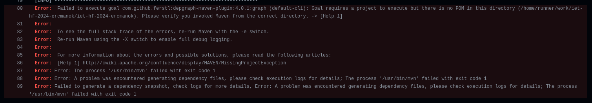
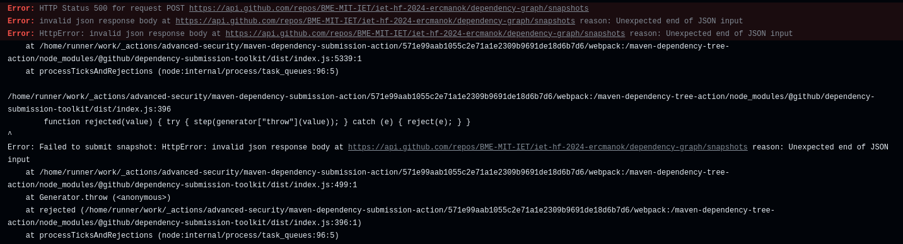

# Build keretrendszer beüzemelése, ha még nincs (Maven) + CI beüzemelése, ha még nincs (GitHub Actions)

A feladat elvégzéséhez előszür is letöltöttem a szükséges csomagokat:
- Apache Maven 3.6.3
- JDK 17

Ezután pedig a megfelelő issue alatt létrehoztam egy saját branchet, ami automatikusan átvette az issue nevét. 

### Először a Maven build keretrendszer beüzemelésével kezdtem

Mivel nem igazán használtam a maven keretrendszert korábban, kezdésként létrehoztam egy különálló projektet a repositoryn kívűl a következő paranccsal, amelyet a maven oldalán találtam:

```
mvn -B archetype:generate -DgroupId=com.mycompany.app -DartifactId=my-app -DarchetypeArtifactId=maven-archetype-quickstart -DarchetypeVersion=1.4
```

Ez létrehozott számomra egy üres projektet, amelybe átmásoltam a a projektünk forrás fájljait. A packagek, és a JDK verzió megadása után a projektet tudtam is buildelni, így ezt kommitoltam és pusholtam a repoba a megfelelő branchen. Később még egy függőséget hozzáadtam a játék egyszerű fordításához (exec-maven-plugin).

### Ezután következett a CI, a Github Actions technlógiáját felhasználva

A gyakorlatnak megfelelően hoztam létre a maven.yml fájlt, ezt azonban nem tudtam a saját branchenbe helyezni, hanem muszáj volt a mainbe raknom. Így ezután a maint belemergeltem a saját branchembe, a build pedig hibára futott, első körben mivel nem találta a pom.xml fájlt.

Miután megadtam a megfelelő elérési utat, rájöttem, hogy a workflow futtatásához a megfelelő eventeket is definiálni kell. Ezzel kicsit többet elmókoltam, mire kiderült számomra, hogy az eventeket a main branchben lévő maven.yml fájlban kell definiálni, és úgy jutnak csak érvényre. A saját branchemben hiába adtam hozzá a workflow_dispatch eventet, amely segítségével bármikor futtatható a workflow, mégsem tudtam azokat futtatni. Illetve még egy fontos tanúlság, hogy bár az eventek a main alapján jutnak érvényre, a joboknál már a branch saját .yml fájlja érvényesül. 



Miután sikeresen megadtam a pom.xml fájl elérési útját minden munkafolyamatbeli lépésnek, a következő hibával szembesültem:



Ezzel a hibával szórakoztam a legtöbbet, nem is értettem, hogyan lehetséges, hogy szerver oldali hibát dob a rendszer. Végül a megoldást stackoverflown találtam meg, a branch nevével volt a hiba. A dokumentáció eleéjn említettem, hogy az issueban, amikor létrehoztam a branchet, automatikusan elnevezte azt a rendszer, azonban ez nem volt jó ötlet. A branch átnevezése után a Build szépen hiba nélkül lefutott, illetve el is küldtem a pull requestet.

## Végső állatot

A git repon belül a projekt a Macisajt-Projlab mappában található. A szükséges szoftverek letöltése után a projekt fordításához, és futtatásához lépjünk be ebbe a mappába.

- fordítás: ```mvn compile ```  
- futtatás: ```mvn exec:java```