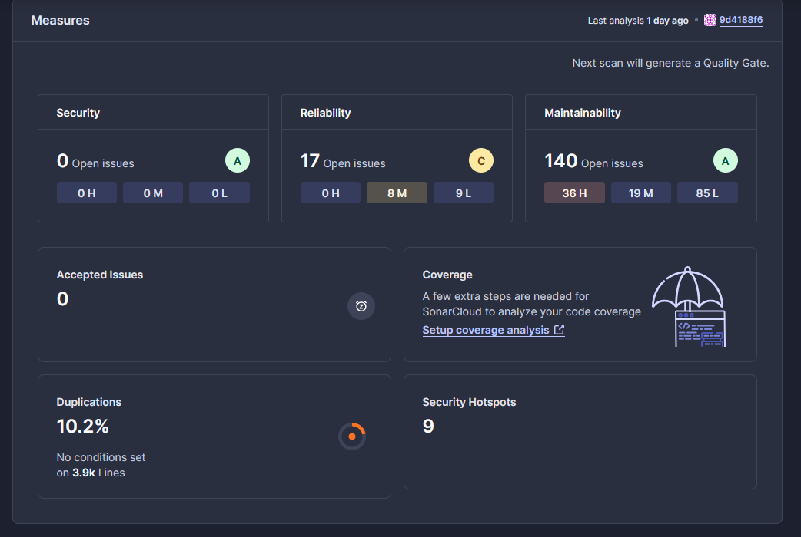
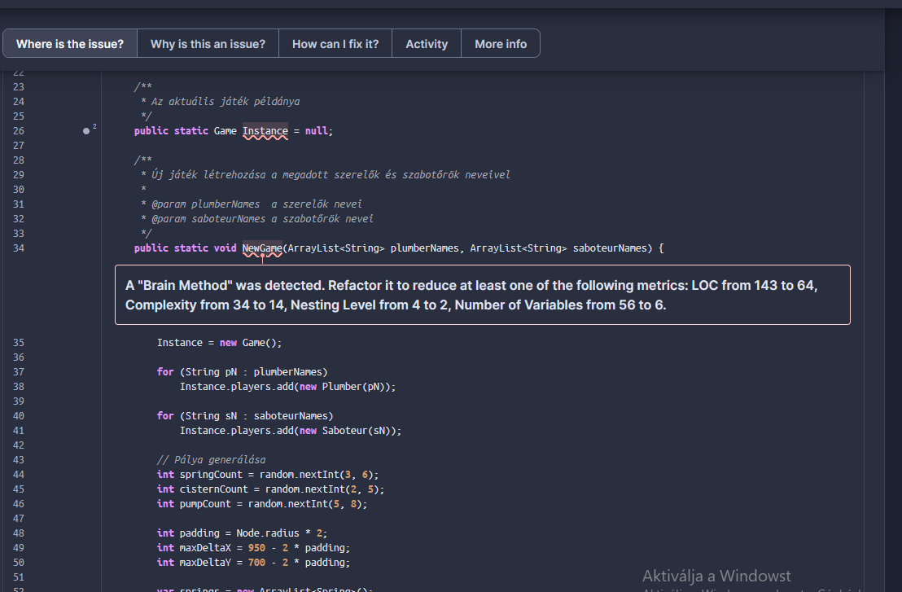
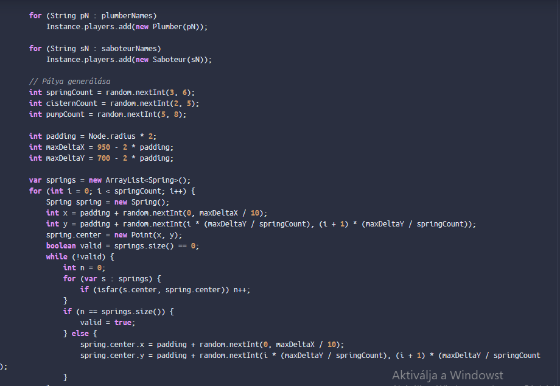
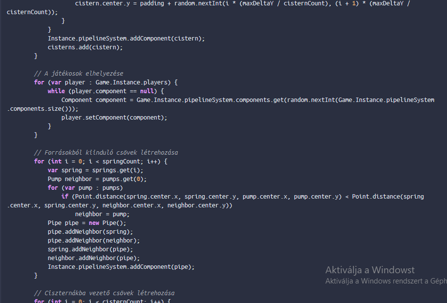
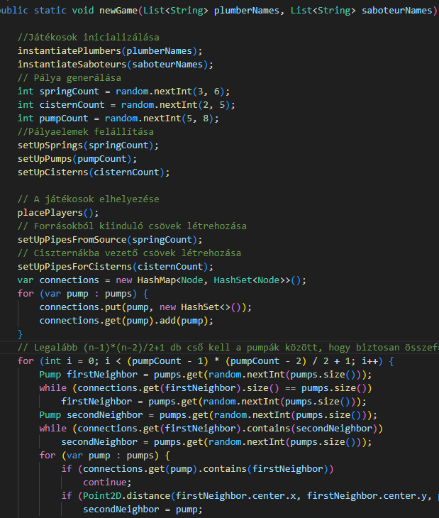

# Statikus analízis Sonar Clouddal

## Az analízis kimenete

A Sonar Cloud linkelése után létrehoztam a sonar cloud workflow-ját, ami első analízisra az alábbi eredményeket produkálta:

A legtöbb probléma amit felfedezett az elnevezési konvenciókban és a változók láthatóságában merült ki, viszont felfedezett egy úgy nevezett "Brain Methodot":

## NewGame Brain Method megszűntetése

A brain method egy olyan függvény, ami egy komplex műveletsort végez az osztályban, nagy terjedelemmel, így nehezen követhető a viselkedése.

A NewGame függvény a leírása alapján létrehoz egy új játékpéldányt, a paraméterben kapott karakter neveket pedig új játékosokként hozza létre.

A függvény működése úgy néz ki, hogy szekvenciálisan megy végig a játék minden használt elemén és létrehozza őket.

Ezt a szekvenciális futást szedtem szét segédfüggvényekre, hogy jobban olvasható legyen a kód.

Előtte:

Utána:

Látható, hogy a függvény olvashatósága javult, a funkcionalitása nem változott, csak a különböző létrehozó függvények ki lettek delegálva a saját metódusokba.

Ezzel a művelettel a függvény komplexitása lecsökkent a Sonar Cloud statisztikája szerint 34-ről 14-re, a beágyazás szintje (nesting) megfelelződött (4->2)

## További optimalizálás

A projekt további részeiben még kisebb változásokat tettem, ami főleg a változó nevekhez kötődik, ezeket nem listáznám ki egyesével.

## Fennálló problémák

Nagyon sok olyan problémát észlel a Sonar Cloud, ami egy hosszútávú projektben nyilván kiküszöbölendő probléma. Például bejegyzett egy UI elemnek az exception kezelésére, hogy változtassuk meg, mielőtt kiekrülne productionbe. Vagy nagyon sok helyen változókat akar statikussá változtatni, amik ha megtesszük a program működését gátolják.

## Összegzés

Az analÍzisben feltárt problémák főleg a kód fenntarthatóságát emelik ki, az elnevezések nem követik a clean code elveket sok helyen.
Számomra a legnagyobb tanulság, hogy a projekt készülése alatt érdemes ezt az eszközt használni, mivel utólag módosítani beégett funkcionalitásokat nagyon bonyolult és gyakran nem azt eredményezi, mint amit szeretnénk.
